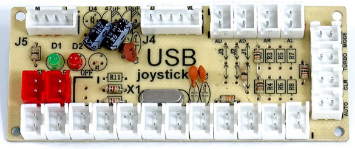

# Build Guide

## What You'll Need

### Tools

#### 3D printer
You'll need access to a 3D printer with a minimum bed size of 219mm x 186mm x 150mm (219x186x150) to fit all the pieces. A 3D printing service is also an option but will make the build significantly more expensive.

#### Soldering iron
A soldering iron and solder is needed to connect all the buttons to your microcontroller.

#### (Optional) Hot glue gun
A hot glue gun and glue sticks are used to secure all the buttons and electronics inside the main body of the guitar.

#### (Optional) Sandpaper
Used to smooth parts of of buttons and the fret bar that come in contact with the guitar body. This depends on if you're using ABS acetone smoothing for the buttons, the tolerance of your printer and the layer height of your printed parts.

!!! todo
    Add some other methods of smoothing prints here? Like in the video.

#### (Optional) Acetone & mason jar

### Parts

#### 3D printer filament
- ~XXXg of PLA or PETG
- (Optional) ~XXXg of ABS

Small amount required for printing fret buttons if you want to smooth them with acetone.

#### 9 x Low profile mechanical key switches

#### Light duty wire  
Any thin light duty wire will work. Approx. 2 metres of stranded Cat 5e (ethernet) cable will contain enough wire for the entire project with spare. Cat 6 and solid core cable will also work but is a little harder to work with.

#### 21 x M3x20mm screws

#### 21 x M3 hex nuts  
Optional but will add strength to the build.

#### Microcontroller
You only need one of these, but there are several options for sending key signals to your PC. Any microcontroller you pick must be able to act as a "USB HID" or it won't work. For example, an Arduino Leonardo will also work for this project, but an Arduino Uno won't without additional hardware.

##### Arduino Pro Micro  
  

This is the more complex option but allows customisation with things like LED strips.

##### USB Encoder

These are very simple microcontrollers designed for DIY arcade machines. You plug buttons into it and it shows up as a joystick on your PC. While it is much quicker than an Arduino to get running, it won't allow you to add features like programmable LED strips. These devices vary a lot in look and manufacturer but they all work the same.

## Steps

### Printing

### Building Body

### Soldering

### Programming Microcontroller
