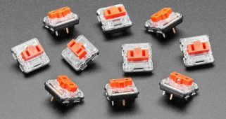
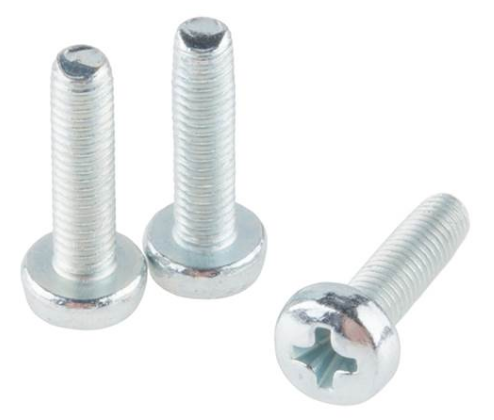
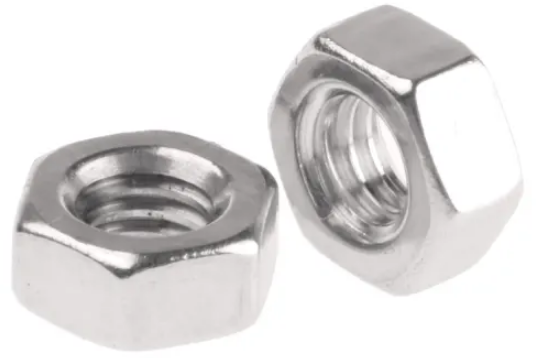
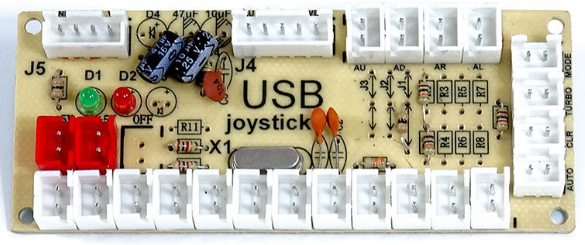
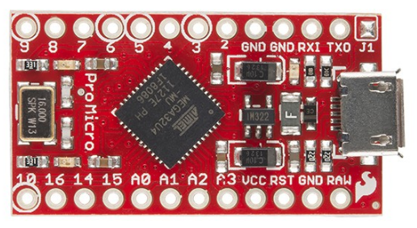

# Supplies

## Shopping List

Here is a quick list of all the parts you need to complete a basic Simple Les
Paul build. You'll also need access to a suitable 3D printer, soldering iron and
a screwdriver.

| Part                                                            | Qty | Where to buy                                                        |
|-----------------------------------------------------------------|-----|---------------------------------------------------------------------|
| [PLA+ filament](#3d-printer-filament)                           | 1kg | Your favourite 3D printing store                                    |
| [Low profile mechanical key switches](#mechanical-key-switches) | 9   | [AliExpress](https://www.aliexpress.com/item/32959996455.html)      |
| Stranded Cat 5e ethernet cable                                  | 2m  | Your local electronics shop                                         |
| M3 20mm screws                                                  | 21  | Your local electronics shop                                         |
| M3 hex nuts                                                     | 9   | Your local electronics shop                                         |
| Arcade USB encoder                                              | 1   | [AliExpress](https://www.aliexpress.com/item/1005003128403655.html) |

See below for a more detailed explanation of each part, alternative parts and
optional extras to make the build better.

## Tools

### 3D Printer
You'll need access to a 3D printer with a minimum bed size of
219mm x 186mm x 150mm (219x186x150) to fit all the pieces. A 3D printing service
is also an option but will make the build significantly more expensive.

### Soldering Iron
A soldering iron and solder is needed to connect all the buttons to your
microcontroller.

### Hot Glue Gun
A hot glue gun and glue sticks are used to secure all the buttons and
electronics inside the main body of the guitar.

### Print Smoothing

#### Sanding
Used to smooth parts of of buttons and the fret bar that come in contact with
the guitar body. This depends on if you're using ABS acetone smoothing for the
buttons, the tolerance of your printer and the layer height of your printed
parts.

#### ABS Smoothing

!!! todo
    Add some other methods of smoothing prints here? Like in the video.

## Parts

### 3D Printer Filament
The entire build will use approximately 650g of PLA filament. Any solid filament
will work, but PLA is easiest to print and is inexpensive.

While not required, it's recommended to also print the fret buttons using ABS
filament which allows you to smooth them with acetone. The only requires
approximately 15g (4m) of filament.

For the fret buttons to work well, it's critical that they're smoothed as much
as possible, so they don't catch on the sides of the neck during use. Acetone
smoothing gives the best possible finish and is much easier than sanding or
painting.

!!! warning
    Printing with ABS produces toxic fumes! You need either a filtered
    enclosure for your printer, or a large well ventilated space to print
    safely.

### Mechanical Key Switches
{ width="300" }

### Wire
Any thin light duty wire will work. Approximately 2 metres of stranded Cat 5e
(ethernet) cable will contain enough wire for the entire project with spare.
Cat 6 and solid core cable will also work but is a little harder to work with.

### M3 Screws
{ width="200" }

### M3 Hex Nuts
{ width="200" }

Adds strength to the build.

### Microcontroller
You only need one of these, but there are several options for sending key
signals to your PC. Any microcontroller you pick must be able to act as a
"USB HID" or it won't work. For example, an Arduino Leonardo will also work for
this project, but an Arduino Uno won't without additional hardware.

#### Arcade USB Encoder
{ width="300" }

These are very simple microcontrollers designed for DIY arcade machines. You
plug buttons into it and it shows up as a joystick on your PC. While it is much
quicker than an Arduino to get running, it won't allow you to add features like
programmable LED strips. These devices vary a lot in look and manufacturer but
they all work the same.

#### Arduino Pro Micro
{ width="300" }

This is the more complex option but allows customisation with things like LED
strips.
